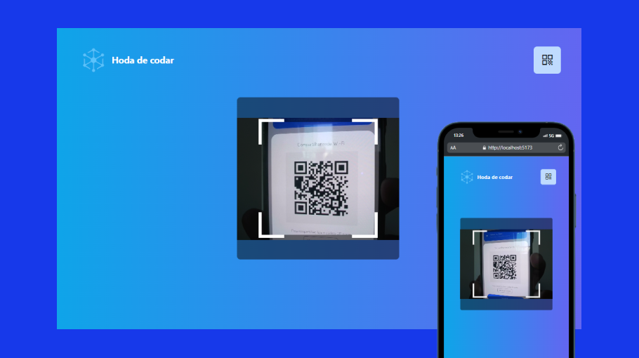

# QrCode Reader with React

A QrCode reader made with the html5-qrcode library with mobile responsiveness using tailwindcss

## Features

- vite
- html5-qrcode 
- tailwindcss

## Getting Started

1. Clone the repository: `git clone https://github.com/Hora-de-Codar/react-QrCode.git`
2. Navigate to the project directory: `cd react-QrCode`
3. Install dependencies: `yarn install` or `npm install`
4. Run the development server: `yarn dev` or `npm run dev`
5. Open [http://localhost:5173](http://localhost:5173) in your browser

## Tests

no test implementation like Cypress and Jest

## Priorities

This project was developed with a focus on creating a qrcode reader for any types of qrcodes, their purpose and deciphering the codes contained in them.